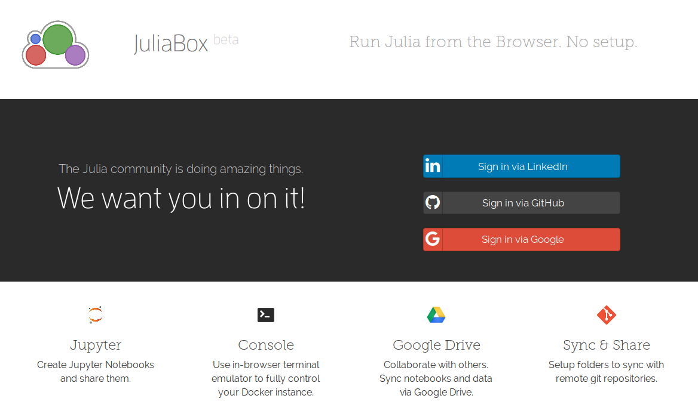
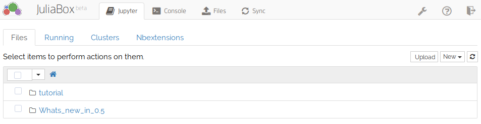
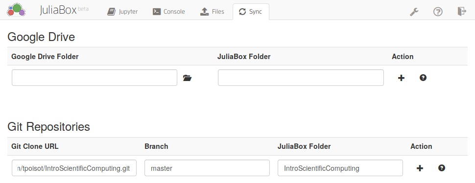
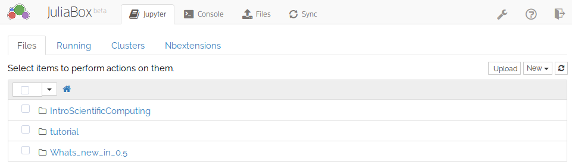

# Introduction to Scientific Computing

Good principles in scientific computing can help you write code that is easier
to maintain, easier to reproduce, and easier to debug. But it can be difficult
to find an introduction to get you started. The goal of this project is to
provide reproducible documents you can use to get started on the most important
points.

This material is aimed at people who have already interacted with a computer
using a programming language, but want to adopt best practices that make their
code more robust. One specific challenge in scientific computing is that we care 
about getting the *right* answer. Therefore, we should adopt practices that make
us less likely to introduce mistakes, and more likely to catch them. This guide will help
you with this.

**TODO** onboarding

## A brief overview of the contents

1. Introduction to notebooks (estimated time: 10 minutes)
1. Controlling the flow
1. Writing functions
1. Defensive programming
1. Debugging strategies and logging

## Getting started

You don't need to install anything! We rely on [JuliaBox.com][jlbox], a
cloud-based service to run reproducible documents in the cloud. We will use the
[Julia][jl] language; but you don't need to know anything about it either. We
will keep the discussion very general, and not use any of the (very cool!)
language-specific features and syntax.

[jlbox]: https://juliabox.com/
[jl]: http://julialang.org/

### Setting up a JuliaBox account

Go to [juliabox.com][jlbox], and you will be greeted with this login screen:

Pick one of the services to login, and you will see the landing page:

### Adding the repository to your JuliaBox account

For the first time *only*, you will need to clik on the `Sync` tab (fourth from the left in the top menu), and let JuliaBox know where the lessons are. This is done by pasting the URL of this project (`https://github.com/tpoisot/IntroScientificComputing.git`), into the *Git Clone URL* field. When you select the next field (under *Branch*), using either your mouse or the Tab key, the information should autocomplete:

After going back to the `Jupyter` tab (first from the left in the top menu), and maybe refreshing the page, you will see a new folder:

Congratulations! Now go click on the folder, and navigate to the *Lessons*.

### Running the notebooks

From the *Lessons* folder, simply clicking on a notebook will launch it. We
suggest you start with the first lesson (`01`), as it contains all you've ever
wanted to know (and some more) about notebooks.

## Full table of contents

1. Introduction to notebooks
  - cells and states
  - order of execution
  - exporting and saving your work

## Contributing

There are a number of ways to contribute. Before you start, please have a look
at our [Code of Conduct][coc]. It boils down to *be nice and respectful* -- no
contribution, no matter how amazing it may be, justifies or excuses bad
behaviour.

[coc]: https://github.com/tpoisot/IntroScientificComputing/blob/master/CODE_OF_CONDUCT.md

The first thing you can do is comment on Issues that have the ["Request for
feedback"][feedback] label. They represent situations for which we are actively
seeking community feedback, and anyone is always welcome to chime in.

[feedback]: https://github.com/tpoisot/IntroScientificComputing/labels/request%20for%20feedback

If there is a more specific point you would like to raise, you can [create a new
Issue][new_issue], and explain your idea, critique, or comment. And of course,
you can always browse the [current Issues][issues], to get a sense of what is
being discussed.

[new_issue]: https://github.com/tpoisot/IntroScientificComputing/issues/new
[issues]: https://github.com/tpoisot/IntroScientificComputing/issues

If you want to contribute more, then great! Have a look at the [contribution
guidelines][cguid] first, to get you started with setting up a development
environment. You can have a look at ["Good first issues"][first], if you want
some inspiration.

[cguid]: https://github.com/tpoisot/IntroScientificComputing/blob/master/CONTRIBUTING.md
[first]: https://github.com/tpoisot/IntroScientificComputing/labels/good%20first%20issue

## Authors

## Other information

